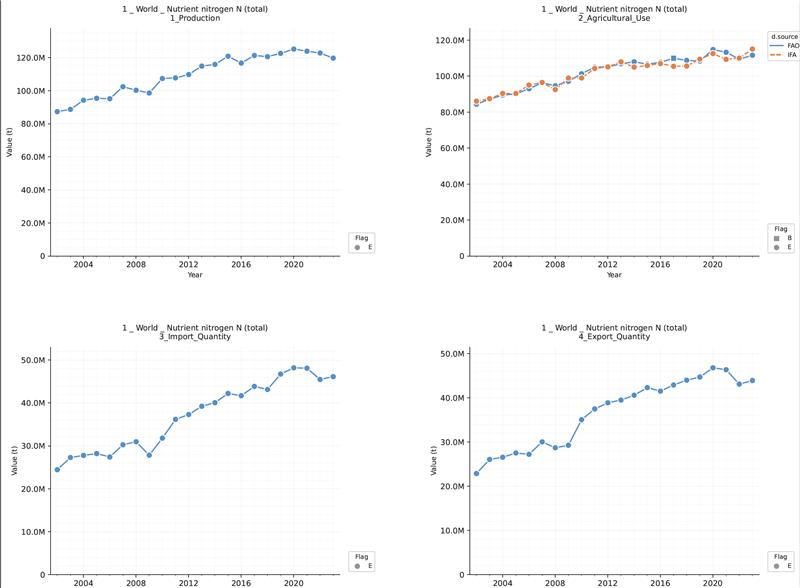
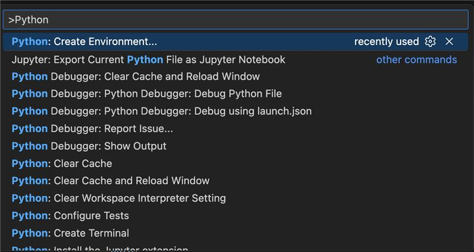

# Multiple Charts Plot

This project contains module (function) to generate multiple charts useful for comparing multiple data sources.

---

## Table of Contents

1. [What is in this project?](#what-is-in-this-project)
2. [Setup Instructions (for Windows, Mac, Linux)](#setup-instructions)
   - [Python Version Requirements](#python-version-requirements)
   - [Create a Virtual Environment in VSCode](#create-a-virtual-environment-in-vscode)
   - [Install Dependencies](#install-dependencies)
3. [How to Use](#how-to-use)
   - [Understanding the Module](#understanding-the-module)
   - [Example: Creating Charts from FAO-IFA Data](#example-creating-charts-from-fao-ifa-data)
4. [Troubleshooting](#troubleshooting)
5. [File Guide](#file-guide)

---

## What is in this project?

This project contains Python scripts that:

- **Read CSV data** (or pandas DataFrames) with time series information
- **Automatically organize plots** into multi-page PDF reports
- **Customize layouts** (how many plots per page, colors, line styles, legends)
- **Support multiple chart types** (line, bar, stacked area, etc.)
- **Handle large datasets** by splitting across files and pages automatically

### Example Output

A sample output of the implemented module is as below:



---

## Setup Instructions

### Python Version Requirements

This project requires **Python 3.9 or newer**. To check your Python version, open a terminal or command prompt and type:

```bash
python --version
```

If you don't have Python installed, download it from [python.org](https://www.python.org/downloads/). Make sure to check **"Add Python to PATH"** during installation (Windows) or follow the installer instructions (Mac/Linux).

---

### Create a Virtual Environment in VSCode

A [**virtual environment**](https://code.visualstudio.com/docs/python/environments) is a folder that isolates your project's Python packages so they don't conflict with other projects.

#### Step 1: Open the Project Folder in VSCode

1. Open VSCode
2. Click **File** > **Open Folder** and select the folder containing these scripts

#### Step 2: Open a Terminal in VSCode

1. Press `Ctrl + ~` (Windows/Linux) or `Cmd + ~` (Mac)
2. A terminal should appear at the bottom of VSCode

#### Step 3: Create the Virtual Environment

To createe a virtual environment easily in VS Code, open the command palete with these keys `Ctrl + Shift + P` and search for **Python: Create Environment** command and select it.



Next you should see a list of environment types: Venv or Conda (_I usually use **Venv**_) select one.


Depending on the selection you make, you should see your different python interpreters installed on you computer. Choose one, these scripts require `Python >= 3.9x`.


Ater you select your interpreter, you should see a notificatino showing the environment created and another that promts you to activate the environment (**Don't worry if you do not see it.**).

Done, your virtual environment has been set up correctly. If the environment has also been activated, you should see `(venv)` at the start of your terminal.


### Create virtual environment from the terminal

Type one of the commands below (depending on your OS):

**Windows (Command Prompt):**
```bash
python -m venv .venv
.venv\Scripts\activate
```

**Windows (PowerShell):**
```bash
python -m venv .venv
.venv\Scripts\Activate.ps1
```

**Mac/Linux:**
```bash
python3 -m venv .venv
source .venv/bin/activate
```

After running the **activate** command, you should see `(.venv)` at the start of your terminal prompt. This means the virtual environment is active.

#### Step 4: Tell VSCode to Use the Virtual Environment

1. In VSCode, press `Ctrl + Shift + P` (Windows/Linux) or `Cmd + Shift + P` (Mac)
2. Type **"Python: Select Interpreter"** and press Enter
3. Choose the one that says `.venv` in the path (e.g., `./.venv/bin/python`)

---

### Install Dependencies

With your virtual environment activated (you should see `(.venv)` in the terminal), run:

```bash
pip install -r requirements.txt
```

This command reads the `requirements.txt` file and installs:
- **pandas** — for reading and organizing data
- **numpy** — for numerical calculations
- **matplotlib** — for creating charts
- **tqdm** — for progress bars (optional but nice to have)

these are required libraries to ensure successful run of the script.

---

## How to Use

### Understanding the Module

The main module is **`multiple_charts_plot.py`**. It contains the `multiple_line_charts()` function, which does all the heavy lifting.

**Key Concepts:**

- **Data (DataFrame):** A table with your data (rows = observations, columns = variables)
- **ChartConfig:** An object that tells the function how to organize your plots
  - `series_by` — column name to split lines/colors (e.g., "Source" for FAO vs. IFA)
  - `plots_by` — column name to create separate plots (e.g., "ElementName" for Nitrogen vs. Phosphorus)
  - `pages_by` — column name to create separate pages (e.g., "Area" for Europe vs. Asia)
  - `x_variable` — the time axis (e.g., "Year")
  - `y_variable` — the values to plot (e.g., "Value")
  - `output_folder` — where to save PDFs
  - `plots_per_row`, `plots_per_column` — how many plots fit on one page

- **ChartStyle:** An object that defines colors, line styles, and markers for your series

---

### Example: Creating Charts from FAO-IFA Data

The file **`plot_fao_ifa.py`** shows a complete example. Here's how it works step-by-step:

#### Step 1: Read Your Data

```python
import pandas as pd
from multiple_charts_plot import multiple_line_charts, ChartConfig, ChartStyle

# Load your CSV file into a pandas DataFrame
data = pd.read_csv("data/fao_ifa_2025.csv")
```

**What this does:**
- Imports the necessary libraries
- Reads a CSV file into a table (DataFrame)

**Your CSV should have columns like:**

| Year | Area_Item | ElementName | d.source | Flag | Unit | Value |
|------|-----------|-------------|----------|------|------|-------|
| 2020 | World     | Nitrogen    | FAO      | E    | t    | 100000000  |
| 2020 | World     | Nitrogen    | IFA      | E    | t    | 980000000  |
| 2021 | World     | Nitrogen    | FAO      | E    | t    | 105000000  |

#### Step 2: Define Chart Styling

```python
style = ChartStyle.from_data(
    data,
    series_by="d.source",  # Use "d.source" column to split colors
    colors=["#5792C9", "#F9844A"],  # Blue for FAO, orange for IFA
    linetypes=["solid", "dashed"]  # Solid for FAO, dashed for IFA
)
```

**What this does:**
- Creates a style object that assigns colors and line styles to each unique value in the `d.source` column
- `#5792C9` is a hex color code (blue); `#F9844A` is orange
- Users can distinguish FAO data (solid blue) from IFA data (dashed orange)

#### Step 3: Create Configuration

```python
config = ChartConfig(
    series_by="d.source",  # Different series (FAO vs. IFA) get different colors/lines
    symbol_by="Flag",  # Add markers for different flag types
    style=style,  # Use the style defined above
    plots_by="ElementName",  # Create separate plots for Nitrogen, Phosphorus, etc.
    x_variable="Year",  # X-axis is years
    y_variable="Value",  # Y-axis is the values
    units="Unit",  # Column with measurement units
    plots_per_row=2,  # 2 plots per row
    plots_per_column=2,  # 2 plots per column (4 plots per page)
    pages_by="Area_Item",  # Create separate pages for each area/item combination
    output_folder="output/",  # Save PDFs to this folder
    file_name="FAO_IFA_compare",  # Output file will be "Plot_FAO_IFA_compare_*.pdf"
    legend_position='right',  # Legend on the right side of each plot
    show_all_years=False,  # Show only years with data
    show_minor_grid=True,  # Include minor gridlines
    marker_size=8,  # Size of data point markers
)
```

**What this does:**
- Configures the layout and styling of all charts
- Each setting controls what the output looks like

#### Step 4: Generate the Charts

```python
result = multiple_line_charts(data, config)
```

**What this does:**
- Calls the main function with your data and configuration
- Returns a `result` object with information about what was created

#### Step 5: Check the Output

A summary of the results will be displayed in the console along wtih any warnings or errors that occured during generation.

The PDFs will be saved in the `output/` folder by default if no directory or save path is defined.

---

## Running Your Own Script

To run `plot_fao_ifa.py`:

1. Make sure your virtual environment is **activated** (you see `(.venv)` in the terminal)
2. Make sure your data file exists at `data/fao_ifa_2025.csv` (or update the path in the script, you can adapt with your own processed data does not need to follow this nor use the columns used in this exercise.)
3. Make sure the `output/` folder exists (create it if needed)
4. Run:

   ```bash
   python plot_fao_ifa.py
   ```

5. Check the `output/` folder for PDFs

---

## Troubleshooting

### "ModuleNotFoundError: No module named 'pandas'"

**Solution:** Your virtual environment is not activated, or dependencies are not installed.

1. Activate the virtual environment (see [Create a Virtual Environment](#create-a-virtual-environment-in-vscode))
2. Install dependencies:
   ```bash
   pip install -r requirements.txt
   ```

### "No such file or directory: 'data/fao_ifa_2025.csv'"

**Solution:** Your CSV file is not in the expected location.

1. Make sure your data file exists
2. Update the file path in your script to match your actual file location:
   ```python
   data = pd.read_csv("path/to/your/file.csv")
   ```

### "FileNotFoundError: output/ directory does not exist"

**Solution:** Create the output folder manually.

1. In your project folder, create a new folder called `output`
2. Or update the `output_folder` setting in ChartConfig to an existing folder

### Plots are not showing or are empty

**Solution:** Check your data and configuration.

1. Make sure your column names in the script match your CSV column names (they're case-sensitive)
2. Make sure your data has values in the `y_variable` column
3. Print the first few rows to inspect:
   ```python
   print(data.head())
   ```

---

## File Guide

| File | Purpose |
|------|---------|
| `multiple_charts_plot.py` | Main module with all plotting functions |
| `plot_fao_ifa.py` | Example script showing how to use the module |
| `requirements.txt` | List of Python packages to install |
| `README.md` | This file |

---

## Next Steps

1. **Run the example:** Try running `plot_fao_ifa.py` with sample data (I can provide upon request)
2. **Adapt for your data:** Modify `plot_fao_ifa.py` to use your own CSV file
3. **Explore settings:** Experiment with different `ChartConfig` options (colors, layouts, etc.)
4. **Read the code:** Open `multiple_charts_plot.py` to understand how the code works

---

## Questions or Issues?

If something doesn't work:
1. Check the **Troubleshooting** section above
2. Read the error message carefully (it often says what went wrong)
3. Inspect your data using `print(data.head())` and `print(data.columns)`
4. Contact me!
